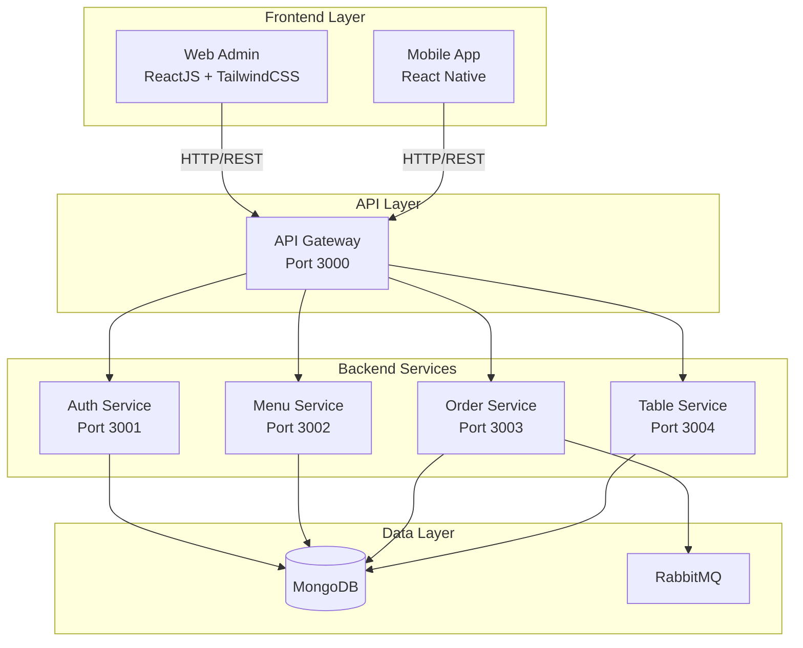
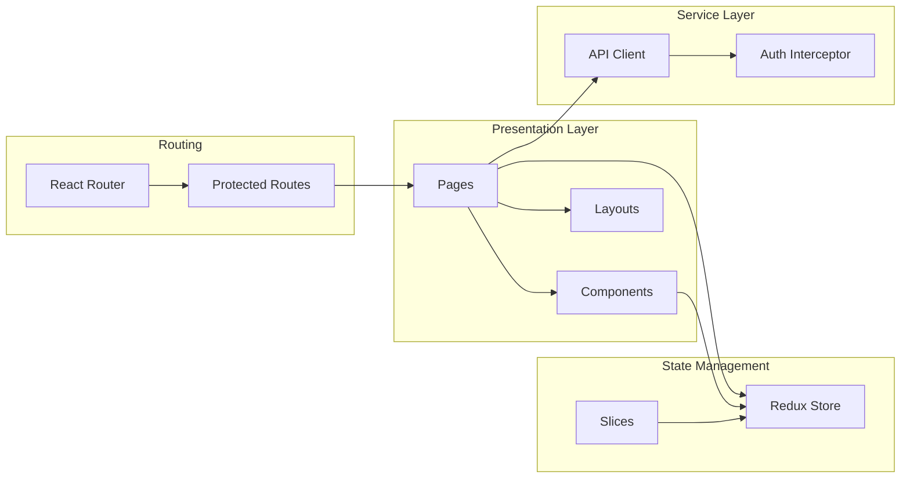
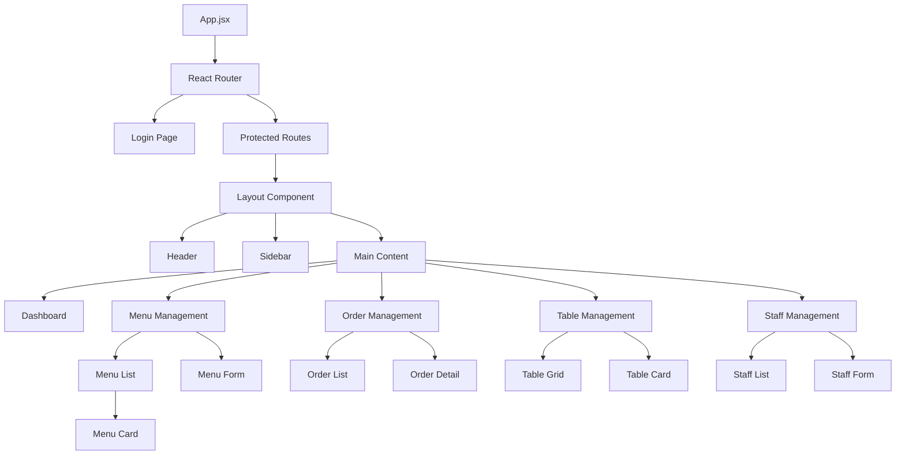

# Design Document: Frontend Architecture Standardization

## Overview

This design document outlines the comprehensive plan to standardize the frontend architecture for the restaurant management system. The primary objectives are:

1. **Consolidate Frontend Applications**: Remove redundant frontend directories (`frontend/` and `frontend-customer/`) and maintain only two frontend applications:
   - **Web Admin** (`frontend-admin/`): ReactJS + TailwindCSS for staff and management
   - **Mobile App** (`mobile-app/`): React Native for customers

2. **Migrate from Material-UI to TailwindCSS**: Replace all Material-UI components with custom TailwindCSS-based components for better performance, smaller bundle size, and more design flexibility.

3. **Implement Responsive Design**: Ensure Web Admin works seamlessly across desktop, tablet, and mobile web browsers.

4. **Maintain Existing Functionality**: Preserve JWT authentication, role-based access control, Redux state management, and API integration without breaking changes.

5. **Improve Developer Experience**: Establish clear patterns, consistent styling, and comprehensive documentation.

### Design Goals

- **Simplicity**: Reduce complexity by removing unused code and dependencies
- **Performance**: Optimize bundle size and loading times through code splitting and lazy loading
- **Maintainability**: Establish consistent patterns and clear separation of concerns
- **Accessibility**: Ensure WCAG 2.1 AA compliance for inclusive user experience
- **Scalability**: Design architecture that can easily accommodate future features

## Architecture

### High-Level System Architecture



### Web Admin Architecture



### Directory Structure

The standardized project structure will be:

```
restaurant-management-system/
├── frontend-admin/              # Web Admin Application (ReactJS + TailwindCSS)
│   ├── public/
│   │   ├── index.html
│   │   └── favicon.ico
│   ├── src/
│   │   ├── components/          # Reusable UI components
│   │   │   ├── common/          # Generic components (Button, Input, Modal, etc.)
│   │   │   ├── layout/          # Layout components (Header, Sidebar, Footer)
│   │   │   └── features/        # Feature-specific components
│   │   ├── pages/               # Page components
│   │   │   ├── Dashboard.jsx
│   │   │   ├── Login.jsx
│   │   │   ├── MenuManagement.jsx
│   │   │   ├── OrderManagement.jsx
│   │   │   ├── TableManagement.jsx
│   │   │   └── StaffManagement.jsx
│   │   ├── store/               # Redux state management
│   │   │   ├── index.js
│   │   │   └── slices/
│   │   │       ├── authSlice.js
│   │   │       ├── menuSlice.js
│   │   │       ├── orderSlice.js
│   │   │       ├── tableSlice.js
│   │   │       └── staffSlice.js
│   │   ├── services/            # API services
│   │   │   ├── api.js           # Axios instance with interceptors
│   │   │   ├── authService.js
│   │   │   ├── menuService.js
│   │   │   ├── orderService.js
│   │   │   ├── tableService.js
│   │   │   └── staffService.js
│   │   ├── hooks/               # Custom React hooks
│   │   │   ├── useAuth.js
│   │   │   ├── useDebounce.js
│   │   │   └── useNotification.js
│   │   ├── utils/               # Utility functions
│   │   │   ├── validators.js
│   │   │   ├── formatters.js
│   │   │   └── constants.js
│   │   ├── styles/              # Global styles
│   │   │   └── index.css        # TailwindCSS imports
│   │   ├── App.jsx              # Root component
│   │   └── index.jsx            # Entry point
│   ├── tailwind.config.js       # TailwindCSS configuration
│   ├── postcss.config.js        # PostCSS configuration
│   ├── package.json
│   ├── Dockerfile
│   └── nginx.conf
│
├── mobile-app/                  # Mobile App (React Native) - UNCHANGED
│   └── ... (existing structure)
│
├── services/                    # Backend microservices
│   ├── api-gateway/
│   ├── auth-service/
│   ├── menu-service/
│   ├── order-service/
│   └── table-service/
│
├── docker-compose.yml
├── README.md
├── DOCKER.md
└── SETUP.md
```

### Technology Stack

**Web Admin:**
- **Framework**: React 18.2+
- **Styling**: TailwindCSS 3.4+
- **State Management**: Redux Toolkit 2.0+
- **Routing**: React Router DOM 6.20+
- **HTTP Client**: Axios 1.6+
- **Build Tool**: Create React App (or Vite for better performance)
- **Authentication**: JWT (JSON Web Tokens)
- **Icons**: Heroicons or Lucide React
- **Form Validation**: Custom validators with TailwindCSS styling

**Mobile App** (unchanged):
- React Native with Expo
- Session-based authentication with tableId

## Components and Interfaces

### Component Hierarchy



### Core Components

#### 1. Layout Components

**Header Component**
- Purpose: Top navigation bar with user info and logout
- Props: `user`, `onLogout`
- Features:
  - Display user name and role
  - Logout button
  - Mobile hamburger menu toggle
  - Responsive design

**Sidebar Component**
- Purpose: Main navigation menu
- Props: `isOpen`, `onClose`, `userRole`
- Features:
  - Navigation links (Dashboard, Menu, Orders, Tables, Staff)
  - Role-based menu items (Staff only for ADMIN)
  - Active link highlighting
  - Collapsible on tablet/mobile
  - Smooth transitions

**Layout Component**
- Purpose: Main layout wrapper combining Header and Sidebar
- Features:
  - Responsive grid layout
  - Outlet for nested routes
  - Persistent navigation state

#### 2. Common Components

**Button Component**
- Variants: primary, secondary, danger, ghost
- Sizes: sm, md, lg
- States: default, hover, active, disabled, loading
- Props: `variant`, `size`, `disabled`, `loading`, `onClick`, `children`

**Input Component**
- Types: text, email, password, number, tel
- Features: label, error message, helper text, icons
- Props: `type`, `label`, `error`, `helperText`, `icon`, `value`, `onChange`

**Modal Component**
- Features: backdrop, close button, header, body, footer
- Props: `isOpen`, `onClose`, `title`, `children`, `footer`

**Table Component**
- Features: sortable columns, pagination, row selection, responsive
- Props: `columns`, `data`, `onSort`, `onPageChange`, `loading`

**Card Component**
- Features: header, body, footer, hover effects
- Props: `title`, `subtitle`, `children`, `footer`, `onClick`

**Badge Component**
- Variants: success, warning, danger, info
- Props: `variant`, `children`

**Notification/Toast Component**
- Types: success, error, warning, info
- Features: auto-dismiss, close button, icon
- Props: `type`, `message`, `duration`, `onClose`

**Loading Spinner Component**
- Sizes: sm, md, lg
- Props: `size`, `color`

**Empty State Component**
- Features: icon, message, action button
- Props: `icon`, `message`, `actionLabel`, `onAction`

#### 3. Feature Components

**MenuCard Component**
- Purpose: Display menu item with image, name, price, actions
- Props: `item`, `onEdit`, `onDelete`, `onToggleAvailability`

**MenuForm Component**
- Purpose: Create/edit menu item form
- Props: `initialData`, `onSubmit`, `onCancel`
- Fields: name, description, price, category, image, availability

**OrderCard Component**
- Purpose: Display order summary with status
- Props: `order`, `onViewDetail`, `onUpdateStatus`

**OrderDetail Component**
- Purpose: Detailed order view with items and customer info
- Props: `order`, `onUpdateStatus`, `onClose`

**TableCard Component**
- Purpose: Display table status and occupancy
- Props: `table`, `onUpdateStatus`, `onViewOrders`

**StaffCard Component**
- Purpose: Display staff member info
- Props: `staff`, `onEdit`, `onDelete`, `onToggleStatus`

**StaffForm Component**
- Purpose: Create/edit staff member form
- Props: `initialData`, `onSubmit`, `onCancel`
- Fields: fullName, username, password, role, phone, email

### Component Interfaces

#### Authentication Flow

```typescript
// Auth State Interface
interface AuthState {
  user: User | null;
  token: string | null;
  isAuthenticated: boolean;
  role: 'ADMIN' | 'MANAGER' | 'WAITER' | 'CHEF' | null;
}

interface User {
  id: string;
  username: string;
  fullName: string;
  role: 'ADMIN' | 'MANAGER' | 'WAITER' | 'CHEF';
  email?: string;
  phone?: string;
}

// Auth Actions
interface AuthActions {
  setCredentials: (payload: { token: string }) => void;
  logout: () => void;
}
```

#### Menu Management

```typescript
interface MenuItem {
  _id: string;
  name: string;
  description: string;
  price: number;
  category: string;
  imageUrl?: string;
  isAvailable: boolean;
  createdAt: string;
  updatedAt: string;
}

interface MenuState {
  items: MenuItem[];
  loading: boolean;
  error: string | null;
  currentPage: number;
  totalPages: number;
}

interface MenuActions {
  fetchMenuItems: () => Promise<void>;
  createMenuItem: (data: Omit<MenuItem, '_id' | 'createdAt' | 'updatedAt'>) => Promise<void>;
  updateMenuItem: (id: string, data: Partial<MenuItem>) => Promise<void>;
  deleteMenuItem: (id: string) => Promise<void>;
  toggleAvailability: (id: string) => Promise<void>;
}
```

#### Order Management

```typescript
interface Order {
  _id: string;
  tableId: string;
  tableName: string;
  items: OrderItem[];
  totalAmount: number;
  status: 'PENDING' | 'PREPARING' | 'READY' | 'SERVED' | 'COMPLETED' | 'CANCELLED';
  customerNote?: string;
  createdAt: string;
  updatedAt: string;
}

interface OrderItem {
  menuItemId: string;
  name: string;
  quantity: number;
  price: number;
  subtotal: number;
}

interface OrderState {
  orders: Order[];
  loading: boolean;
  error: string | null;
  selectedOrder: Order | null;
}

interface OrderActions {
  fetchOrders: (filters?: OrderFilters) => Promise<void>;
  fetchOrderById: (id: string) => Promise<void>;
  updateOrderStatus: (id: string, status: Order['status']) => Promise<void>;
  cancelOrder: (id: string) => Promise<void>;
}
```

#### Table Management

```typescript
interface Table {
  _id: string;
  tableNumber: string;
  capacity: number;
  status: 'AVAILABLE' | 'OCCUPIED' | 'RESERVED' | 'MAINTENANCE';
  currentOrderId?: string;
  qrCode?: string;
  createdAt: string;
  updatedAt: string;
}

interface TableState {
  tables: Table[];
  loading: boolean;
  error: string | null;
}

interface TableActions {
  fetchTables: () => Promise<void>;
  createTable: (data: Omit<Table, '_id' | 'createdAt' | 'updatedAt'>) => Promise<void>;
  updateTable: (id: string, data: Partial<Table>) => Promise<void>;
  deleteTable: (id: string) => Promise<void>;
  updateTableStatus: (id: string, status: Table['status']) => Promise<void>;
}
```

#### Staff Management

```typescript
interface Staff {
  _id: string;
  username: string;
  fullName: string;
  role: 'ADMIN' | 'MANAGER' | 'WAITER' | 'CHEF';
  email?: string;
  phone?: string;
  isActive: boolean;
  createdAt: string;
  updatedAt: string;
}

interface StaffState {
  staff: Staff[];
  loading: boolean;
  error: string | null;
}

interface StaffActions {
  fetchStaff: () => Promise<void>;
  createStaff: (data: Omit<Staff, '_id' | 'createdAt' | 'updatedAt'> & { password: string }) => Promise<void>;
  updateStaff: (id: string, data: Partial<Staff>) => Promise<void>;
  deleteStaff: (id: string) => Promise<void>;
  toggleStaffStatus: (id: string) => Promise<void>;
}
```

## Data Models

### TailwindCSS Configuration

**tailwind.config.js**

```javascript
/** @type {import('tailwindcss').Config} */
module.exports = {
  content: [
    "./src/**/*.{js,jsx,ts,tsx}",
  ],
  theme: {
    extend: {
      colors: {
        primary: {
          50: '#eff6ff',
          100: '#dbeafe',
          200: '#bfdbfe',
          300: '#93c5fd',
          400: '#60a5fa',
          500: '#3b82f6',
          600: '#2563eb',
          700: '#1d4ed8',
          800: '#1e40af',
          900: '#1e3a8a',
          950: '#172554',
        },
        secondary: {
          50: '#f8fafc',
          100: '#f1f5f9',
          200: '#e2e8f0',
          300: '#cbd5e1',
          400: '#94a3b8',
          500: '#64748b',
          600: '#475569',
          700: '#334155',
          800: '#1e293b',
          900: '#0f172a',
          950: '#020617',
        },
        success: {
          50: '#f0fdf4',
          100: '#dcfce7',
          500: '#22c55e',
          600: '#16a34a',
          700: '#15803d',
        },
        warning: {
          50: '#fffbeb',
          100: '#fef3c7',
          500: '#f59e0b',
          600: '#d97706',
          700: '#b45309',
        },
        danger: {
          50: '#fef2f2',
          100: '#fee2e2',
          500: '#ef4444',
          600: '#dc2626',
          700: '#b91c1c',
        },
      },
      fontFamily: {
        sans: ['Inter', 'system-ui', 'sans-serif'],
      },
      spacing: {
        '128': '32rem',
        '144': '36rem',
      },
      borderRadius: {
        '4xl': '2rem',
      },
      boxShadow: {
        'soft': '0 2px 15px -3px rgba(0, 0, 0, 0.07), 0 10px 20px -2px rgba(0, 0, 0, 0.04)',
      },
    },
    screens: {
      'sm': '640px',
      'md': '768px',
      'lg': '1024px',
      'xl': '1280px',
      '2xl': '1536px',
    },
  },
  plugins: [
    require('@tailwindcss/forms'),
  ],
}
```

### Responsive Breakpoints

- **Mobile**: < 768px (sm)
  - Single column layout
  - Hamburger menu
  - Stacked forms
  - Horizontal scrollable tables

- **Tablet**: 768px - 1023px (md)
  - Collapsible sidebar
  - Two-column grids
  - Responsive tables

- **Desktop**: ≥ 1024px (lg, xl, 2xl)
  - Full sidebar navigation
  - Multi-column grids
  - Full-width tables

### Color Scheme

**Primary Colors:**
- Primary Blue: `#3b82f6` (primary-500) - Main actions, links, active states
- Secondary Gray: `#64748b` (secondary-500) - Text, borders, inactive states

**Status Colors:**
- Success Green: `#22c55e` - Success messages, available status
- Warning Orange: `#f59e0b` - Warnings, pending status
- Danger Red: `#ef4444` - Errors, delete actions, critical status
- Info Blue: `#3b82f6` - Information messages

**Background Colors:**
- White: `#ffffff` - Main background
- Light Gray: `#f8fafc` (secondary-50) - Card backgrounds
- Dark Gray: `#1e293b` (secondary-800) - Sidebar, header

**Text Colors:**
- Primary Text: `#0f172a` (secondary-900)
- Secondary Text: `#64748b` (secondary-500)
- Muted Text: `#94a3b8` (secondary-400)

### Typography

**Font Family:**
- Primary: Inter (Google Fonts)
- Fallback: system-ui, sans-serif

**Font Sizes:**
- xs: 0.75rem (12px)
- sm: 0.875rem (14px)
- base: 1rem (16px)
- lg: 1.125rem (18px)
- xl: 1.25rem (20px)
- 2xl: 1.5rem (24px)
- 3xl: 1.875rem (30px)
- 4xl: 2.25rem (36px)

**Font Weights:**
- normal: 400
- medium: 500
- semibold: 600
- bold: 700

## State Management

### Redux Store Structure

```javascript
{
  auth: {
    user: User | null,
    token: string | null,
    isAuthenticated: boolean,
    role: string | null
  },
  menu: {
    items: MenuItem[],
    loading: boolean,
    error: string | null,
    currentPage: number,
    totalPages: number,
    filters: {
      category: string | null,
      search: string | null,
      availability: boolean | null
    }
  },
  orders: {
    orders: Order[],
    loading: boolean,
    error: string | null,
    selectedOrder: Order | null,
    filters: {
      status: string | null,
      tableId: string | null,
      dateRange: { start: string, end: string } | null
    }
  },
  tables: {
    tables: Table[],
    loading: boolean,
    error: string | null,
    filters: {
      status: string | null
    }
  },
  staff: {
    staff: Staff[],
    loading: boolean,
    error: string | null
  },
  ui: {
    sidebarOpen: boolean,
    notifications: Notification[],
    theme: 'light' | 'dark'
  }
}
```

### Redux Slice Patterns

Each slice follows this consistent pattern:

```javascript
import { createSlice, createAsyncThunk } from '@reduxjs/toolkit';
import * as service from '../../services/exampleService';

// Async thunks
export const fetchItems = createAsyncThunk(
  'example/fetchItems',
  async (params, { rejectWithValue }) => {
    try {
      const response = await service.getItems(params);
      return response.data;
    } catch (error) {
      return rejectWithValue(error.response?.data?.message || 'Failed to fetch items');
    }
  }
);

// Slice
const exampleSlice = createSlice({
  name: 'example',
  initialState: {
    items: [],
    loading: false,
    error: null,
  },
  reducers: {
    clearError: (state) => {
      state.error = null;
    },
  },
  extraReducers: (builder) => {
    builder
      .addCase(fetchItems.pending, (state) => {
        state.loading = true;
        state.error = null;
      })
      .addCase(fetchItems.fulfilled, (state, action) => {
        state.loading = false;
        state.items = action.payload;
      })
      .addCase(fetchItems.rejected, (state, action) => {
        state.loading = false;
        state.error = action.payload;
      });
  },
});

export const { clearError } = exampleSlice.actions;
export default exampleSlice.reducer;
```

### Data Flow

```mermaid
sequenceDiagram
    participant UI as UI Component
    participant Redux as Redux Store
    participant Thunk as Async Thunk
    participant API as API Service
    participant Backend as Backend API
    
    UI->>Redux: Dispatch action
    Redux->>Thunk: Execute async thunk
    Thunk->>API: Call service method
    API->>Backend: HTTP request
    Backend-->>API: HTTP response
    API-->>Thunk: Return data
    Thunk->>Redux: Dispatch fulfilled/rejected
    Redux->>UI: Update component via selector
